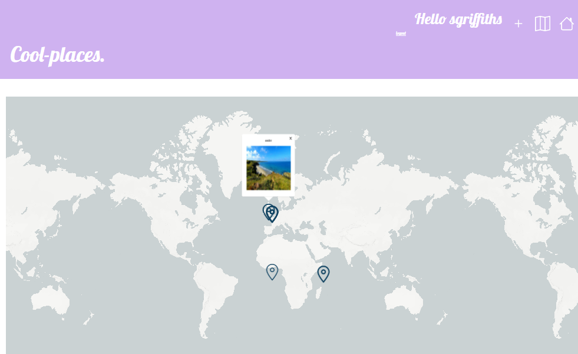
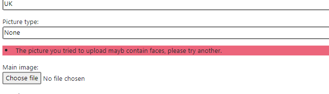

# Project to compare pyramid with django, with a nice map to display uploaded pics.

```
git clone https://github.com/sarahjeeeze/cool-places.git
cd cool-places
./setup.bat
```
To create admin user - 
python manage.py createsuperuser
create username and password



Also it will not let you upload pictures with faces in.. my original idea was like an anti facebook thing.


